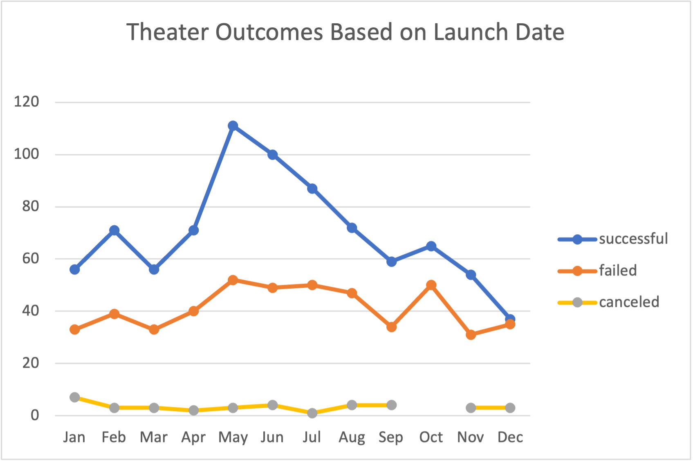
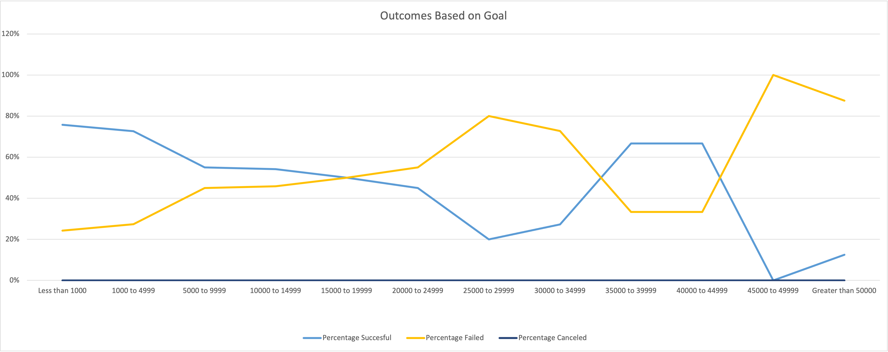

# Overview of Project
Although Louise has already finished her campaign, she wants to find out how her campaign fared in comparison to the other theatre campaigns. To be able to do this, the analyses created below, which are outcomes based on goals and outcomes based on launch dates were created.

## Analysis and Challenges

### Theatre Outcomes Based on Launch Date
The table/chart shows us the different outcomes based on the months the theatre Kickstarter campaigns were launched. For the canceled theatre campaigns, its line graph is not continuous as there is a break in October, where no kickstarter campaigns were canceled.

### Outcomes Based on Goals
Except for the first(below $1000) and last amounts ($50,000 or greater), the goals are broken down in $5000 increments. Instead of graphing the *number* of individual outcomes, we used the the *percentages* for each of the outcomes in each categorgy or goal because we wanted to find out the rate of success or failure for each category or bracket amount. The noticeable line graphs only show the percaentages of successful and failed campaigns, as there are no cancelled campaigns in the data provided.

### Challenges

Creating the table and chart for Theatre Outcomes by Launch Date was a bit challenging for me, becasue I was not familiar with most of the capabilities/functions of the different tabs in Excel. It was a good thing the hints were posted and I was able to compare my work, backtrack and see where I might have made errors. I had to figure where to put the % sign on the values on the y-axis, once i changed the format of the data on the corresponding columns, I was able to do it.

As for the Theatre Outcomes baned on Launch Date chart/graph, the only challenge i had was changing or customizing the lines on the graph. Initially, I wanted them to match the colors assigned on the Kickstarter table, but I figured it would be safer to have the same format as the one shown on the module, as no specific instructionw sere given

## Results
### Theater Outcomes by Launch Date
Based on the data provided, the months of May, June and July are months with the most successful campaigns launched, with May having the highest number of successful campaigns. 
The campaigns launched in December and October had the most number of failed campaigns.

### Outcomes Based on Goals
More than 70% of Kickstarter Campaigns with goals that are at $5,000 and below were much more successful at reaching their goals and the campaigns with goals of 45,000 or greater had more difficulty reaching their goal. 
Based on the data for the goals between $20,000 to less than $45,000, there might be more factors in play for the success or failure of reaching the goal, specifically in this range of amount, than just the amount of the goal itself. 

### Limitations and Recommendations for Additional Tables or Graphs
Since we knew what Louise's goal was, I think it would be interesting not just to take a look at the launch dates but to take a look at the the duration of the successful campaigns and to find out the relationship between the launch dates and the goals while only focusing on Louise’s goal or target of $12,000 (10000-14999). 
